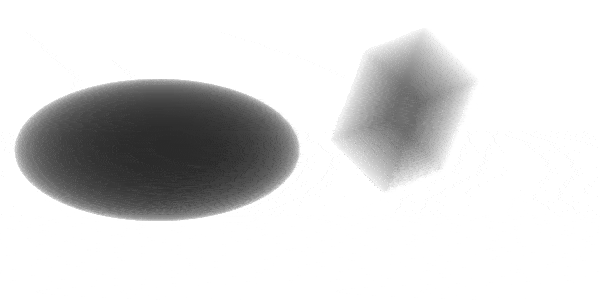

# Tomographic reconstruction of ray-traced simulated X-ray image

- The simulated X-ray images

  

- Corresponding projection integral of 150th slice

  

- Final reconstruction of 300 slices

  

## Running the pipeline

- One needs to build the ray tracer binary first. Refer to the instruction in `README.md` in `raytracer/` folder.
- Run the code in Jupyter notebook [file](./script/ct.ipynb).
